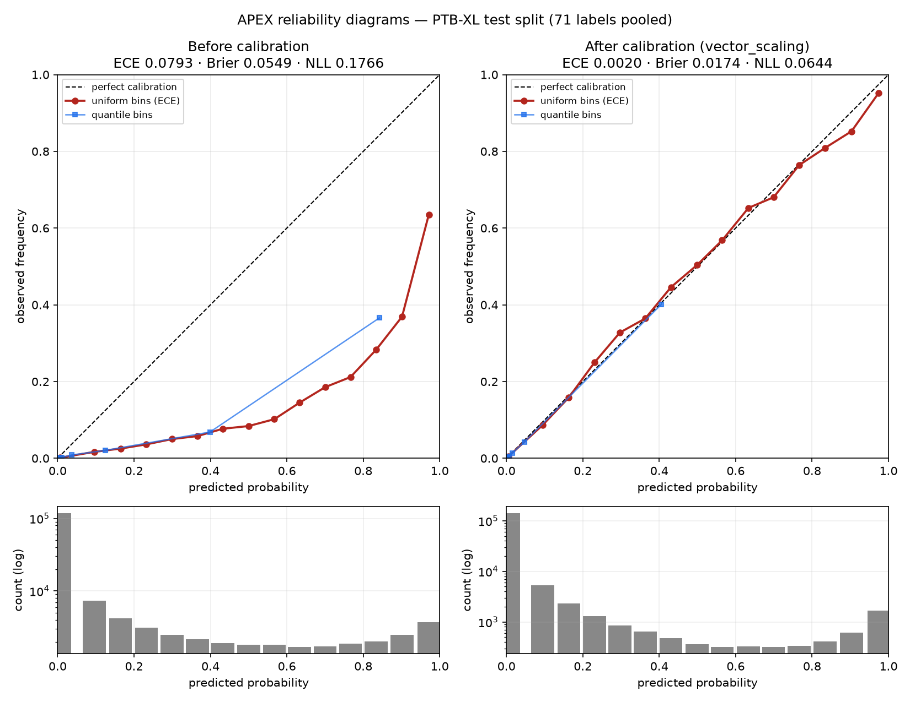

# Phase 17 — Multi-label confidence calibration

`APEX (cnn_bce)` — calibrators fitted on **validation (fold 9)** (2183 records) and evaluated on **test (fold 10)** (2198 records). Regenerate with `python scripts/calibrate.py`.

## Headline

**ECE 0.0793 → 0.0020** (98% reduction) via `vector_scaling`, with **macro-AUROC unchanged at 0.9200** — every transform here is monotonic per label, so calibration costs nothing in discrimination. The script asserts that equality rather than assuming it.

## Results

| method | ECE ↓ | classwise ECE ↓ | MCE ↓ | Brier ↓ | NLL ↓ | macro-AUROC |
|---|---:|---:|---:|---:|---:|---:|
| _uncalibrated_ | 0.0793 | 0.1098 | 0.5549 | 0.0549 | 0.1766 | 0.9200 |
| `temperature` | 0.0875 ⚠ | 0.1194 | 0.5026 | 0.0539 | 0.1719 | 0.9200 |
| `per_label_temperature` | 0.0890 ⚠ | 0.1210 | 0.5083 | 0.0531 | 0.1697 | 0.9200 |
| `vector_scaling` **← best** | **0.0020** | 0.0080 | 0.0510 | 0.0174 | 0.0644 | 0.9200 |

Global temperature fitted to **T = 1.284** (> 1 ⇒ the raw model was over-confident and needed softening).

### Temperature scaling alone did not work — and that is the interesting result

Plain temperature scaling moved ECE **0.0793 → 0.0875: slightly *worse*.** Per-label temperature was no better (0.0890). Both nonetheless improved NLL and Brier, which is the clue to what is going on.

Temperature scaling divides the logit: it can only make a distribution sharper or softer around the point where the logit is zero. It **cannot shift** it. But this model's miscalibration is overwhelmingly a *bias*: it was trained with class-weighted BCE (per-label `pos_weight` capped at 50) precisely so rare positives would not be ignored, and that systematically inflates the positive class. Mean predicted probability is 0.118 against a base rate of 0.039 — about 3.0x too high, roughly uniformly. Softening a distribution that is *displaced* pulls the confident tail toward the middle without moving the bulk, so the aggregate log-loss improves while the reliability curve does not straighten.

`vector_scaling` adds the per-label intercept `b_j`, which is exactly the degree of freedom needed to undo a bias — and it removes essentially all of the error (0.0793 → 0.0020). It is still a monotonic per-label transform, so it is temperature scaling's natural generalization rather than a different kind of animal: same post-hoc, same validation fit, same preserved ranking, one more parameter per label.

That all three of ECE, Brier and NLL improve together under vector scaling is the check that this is a genuine gain and not ECE-gaming — Brier and NLL are proper scoring rules and cannot be improved by re-binning.

## Reading the diagram

The dashed diagonal is perfect calibration: a bin of predictions at 0.8 should contain 80% positives. Points **below** the line are over-confidence. Two binning strategies are drawn because they answer different questions — uniform bins are what ECE is defined over, but 3.9% of label-instances are positive and most probability mass piles up near zero, so equal-count (quantile) bins are far more readable. The log-scale histogram beneath each diagram shows where the predictions actually live; a reliability diagram without it is easy to over-read.

## Downstream effect: does it fix the Phase-13 over-flagging?

At the shipped surfacing threshold (0.5):

| | before | after |
|---|---:|---:|
| Spurious labels surfaced per record | 5.09 | **0.35** |
| Missed true labels per record | 0.45 | 1.22 |
| Label recall | 0.837 | 0.560 |
| micro-F1 | 0.456 | **0.664** |
| macro-F1 | 0.266 | 0.214 |

Calibration cuts spurious surfaced labels **93%** (5.09 → 0.35 per record) and micro-F1 *improves* 0.456 → 0.664, with label recall 0.837 → 0.560. This is the same 0.5 threshold as before — only the probabilities changed. Recall falls because over-confident true positives are pulled down too; calibration makes the threshold *mean* what it says, it does not conjure discrimination that was never there.

Worth noting for scale: Phase 12 reported micro-F1 **0.598** using per-label thresholds *tuned on validation*. Calibrated probabilities at a single fixed 0.5 reach **0.664** — better than tuned thresholds on uncalibrated outputs, from one post-hoc fit and no per-label threshold search.

The right follow-up is to re-tune the operating threshold *after* calibration: 0.5 was never a principled choice, and on calibrated probabilities it now carries an interpretable meaning ('50% chance this finding is present'), so the threshold becomes a clinical decision about sensitivity rather than an artifact of how the model was trained.

## Correction to earlier phases

Phases 3 and 12–16 quoted **"ECE ≈ 0.90"**. That figure was produced by a mis-specified metric and is **wrong**; the correct value for the uncalibrated model is **0.0793**.

The old implementation binned by predicted probability but compared each bin's mean probability against the **accuracy of the thresholded decision** — the formulation for *multi-class softmax* confidence, where the quantity being calibrated is `max_k p_k` against whether the argmax was right. For independent per-label sigmoids the correct comparison is a bin's mean probability against its **empirical positive rate**.

Why it mattered so much here: **78% of all label-instances sit at p < 0.1**, almost all of them true negatives. Their accuracy is ≈0.998 (predicting "absent" is correct) while their mean probability is ≈0.009, so the old metric charged ≈0.99 of error to predictions that were in fact well calibrated. That one mismatch manufactured essentially the whole 0.90. `accuracy_style_ece()` is kept in `src/eval/calibration.py` purely to reproduce the old number (0.897) and is documented as not fit for reporting.

**What survives the correction:** the model *is* genuinely over-confident — mean predicted probability 0.118 against a true base rate of 0.039, roughly 3.0x — and that over-confidence is what drives the Phase-13 over-flagging. The diagnosis was right; the magnitude was overstated by a broken metric. Prior reports have not been silently rewritten; this section is the correction of record.

## Limitations

- Calibration is fitted on one validation fold from one dataset; it is a property of *this* distribution and would need refitting under any shift (new site, hardware, population).
- Per-label methods fall back to the global fit for labels with fewer than 10 validation positives — **21 of 71 labels** are too rare to fit individually, exactly the rare labels Phase 13 found weakest, so their probabilities remain the least trustworthy.
- ECE is bin-count dependent; all figures here use 15 uniform bins, and the quantile curve is shown alongside so the conclusion does not rest on one binning choice.
- Calibration corrects *probabilities*, not the underlying errors: it cannot recover a finding the model never ranked highly (Phase 13's rare-label misses).

The fitted parameters are saved to `outputs/calibration.json` and can be reloaded with `src.eval.calibration.load_scaler`.
