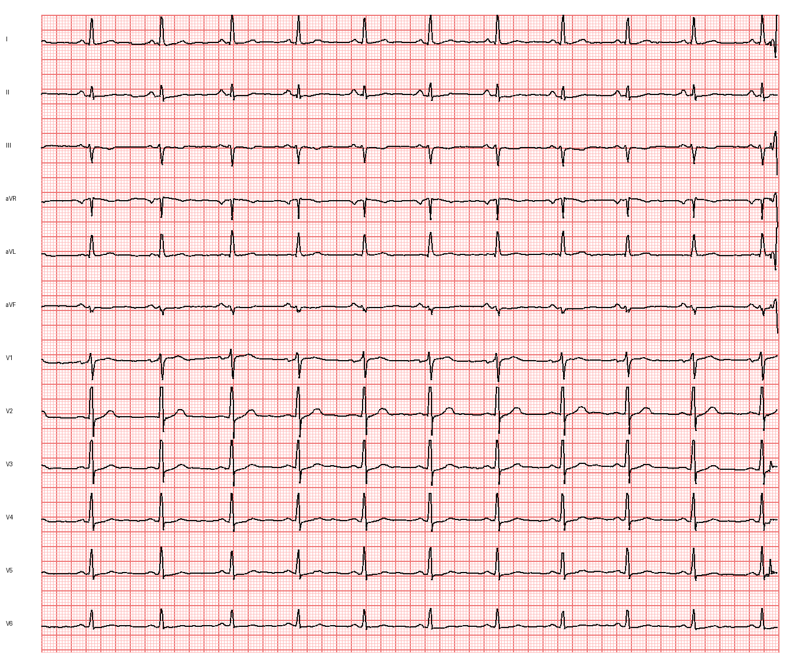
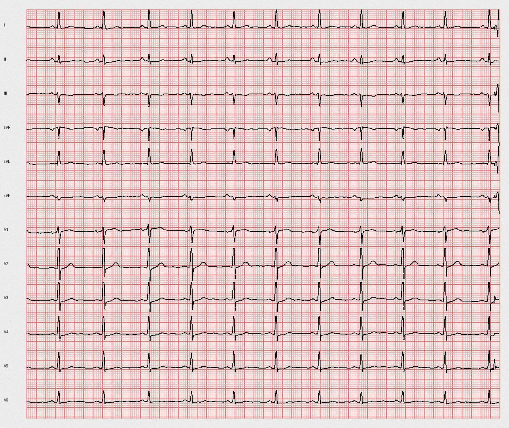
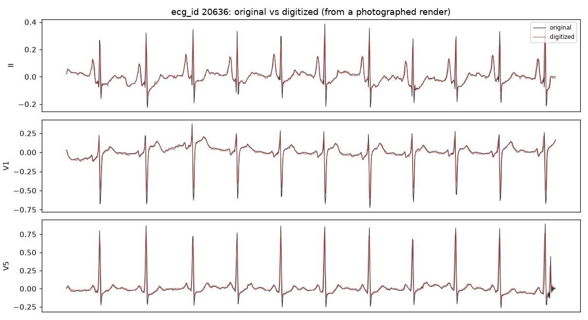

# Phase 10 — ECG image digitization: fidelity report

Round-trip reconstruction fidelity over **100 random PTB-XL records**, measured by `scripts/eval_digitization.py`: each signal is rendered to a paper-ECG image, digitized back to a `(12, T)` signal, and compared per lead.

**Metric**: mean per-lead Pearson correlation between the original and the digitized signal (resampled to a common length + best small-lag alignment, so a global time/gain calibration offset isn't scored as lost shape), plus normalized RMSE (RMSE / original std). `corr p10` is the 10th-percentile record — the typical worst case, not the average.

## Results

| photo level | corr (mean) | corr (std) | corr p10 | nRMSE (mean) |
|---|---:|---:|---:|---:|
| 0.0 — clean render | 0.8848 | 0.0336 | 0.8278 | 0.5101 |
| 0.5 — mild phone-photo | 0.8151 | 0.049 | 0.7459 | 0.6144 |
| 1.0 — heavy phone-photo | 0.7056 | 0.0763 | 0.6257 | 0.802 |

## Examples

Rendered paper ECG (the digitizer's input): 

Same, photographed (blur + noise + JPEG): 

Original vs digitized, three leads: 

## How it works

Classical computer vision (no training data — no dataset of real paper-ECG photos paired with signals exists), in `src/digitization/`:

1. **grid** — the pink grid's bounding box gives the plotting rectangle; the median spacing between detected grid lines gives the px-per-mm calibration.
2. **trace** — an adaptive luminance threshold isolates the dark trace ink from the lighter grid; each of the 12 stacked lead bands is read column-by-column as the darkness-weighted centroid row.
3. **calibrate** — pixels -> mm via the grid pitch, mm -> mV / seconds via the standard 10 mm/mV and 25 mm/s; the per-lead baseline is removed and each lead is resampled to the target rate.

## Honest limitations

- **Validated on rendered images**, not real-world phone photos. The `photo` levels approximate blur/noise/JPEG but not perspective skew, folds, or shadows; a learned trace/grid segmentation model (trainable on this renderer's paired output) is the natural upgrade for those, and the reason to keep the renderer around.
- **Sharp QRS peaks are the main fidelity loss** — raster digitization smooths narrow, near-vertical strokes, so clean fidelity sits around 0.9 rather than ~1.0 (a clean sine round-trips at 0.998).
- The **standard clinical 3x4 mosaic carries only 2.5 s per lead**, so full 12-lead x 10 s reconstruction uses the stacked full-width layout; the mosaic is rendered for display only.
