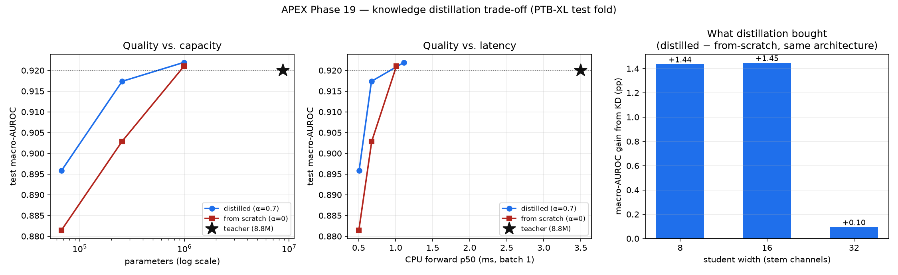

# Phase 19 — Knowledge distillation to a lightweight student

Teacher: the shipped Phase-4 detector (`cnn_bce`, 8,778,055 parameters, 35.2 MB). Students are the same 1D-ResNet family at reduced width and depth, trained to match the teacher's per-label probabilities. Regenerate with `bash scripts/run_distillation.sh`.

## Headline

**35x smaller (8,778,055 → 253,895 parameters, 35.2 MB → 1.1 MB) and 5.2x faster on CPU (3.50 ms → 0.67 ms p50 forward pass, a 81% reduction), for 0.28% degradation in test macro-AUROC (0.9200 → 0.9174).**

End to end, through `analyze_signal`, the same swap moves p50 **6.60 ms → 2.81 ms (57%)**. The end-to-end reduction is smaller than the forward-pass reduction because validation, preprocessing and report generation are untouched by distillation: they cost about **1.7 ms** per request no matter which model is loaded, which is the floor every row in the table sits on. Both figures are reported because quoting only the forward-pass number would be measuring the part that flatters the result.

## Results

| model | params | size (MB) | macro-AUROC | macro-F1 | micro-F1 | fwd p50 (ms) | fwd p95 (ms) | batch-32 (rec/s) | e2e p50 (ms) |
|---|---:|---:|---:|---:|---:|---:|---:|---:|---:|
| **teacher** (cnn_bce) | 8,778,055 | 35.19 | 0.9200 | 0.2658 | 0.4556 | 3.497 | 3.884 | 38 | 6.60 |
| student_w32b1_kd | 988,487 | 3.99 | 0.9219 | 0.2732 | 0.4711 | 1.114 | 1.287 | 202 | 3.11 |
| student_w32b1_scratch | 988,487 | 3.99 | 0.9210 | 0.2769 | 0.4768 | 1.010 | 1.172 | 201 | 2.76 |
| student_w16b1_kd | 253,895 | 1.05 | 0.9174 | 0.2570 | 0.4706 | 0.673 | 0.748 | 387 | 2.81 |
| student_w16b1_scratch | 253,895 | 1.05 | 0.9029 | 0.2332 | 0.4255 | 0.677 | 0.831 | 386 | 2.75 |
| student_w8b1_kd | 66,887 | 0.30 | 0.8958 | 0.2295 | 0.4492 | 0.506 | 0.567 | 587 | 2.74 |
| student_w8b1_scratch | 66,887 | 0.30 | 0.8815 | 0.1984 | 0.3795 | 0.503 | 0.617 | 588 | 2.66 |

## How this was measured

**Latency** is an isolated forward pass on CPU, 400 timed iterations after warmup, on macOS-26.5.2-arm64-arm-64bit with torch 2.13.0. **Quality** is the PTB-XL **test** fold (2198 records); F1 uses the shipped 0.5 threshold rather than per-model tuned thresholds, so the columns are comparable to each other — which is why the teacher's macro-F1 here (0.266) is below the 0.359 in Phase 12, where thresholds were tuned per label on validation.

The two latency regimes are measured at **different thread counts** — batch 1 pinned to 1, batch 32 across all 8 cores — because each is faster at that setting, and each corresponds to a real deployment shape. That is not a convenient assumption; it is measured, and the direction reverses between the two:

| | teacher batch 1 | teacher batch 32 | student batch 1 | student batch 32 |
|---|---:|---:|---:|---:|
| 1 thread | **3.09 ms** | 3982 ms | **0.66 ms** | 107 ms |
| 8 threads | 4.67 ms | **840 ms** | 1.39 ms | **83 ms** |

A single 12x1000 record does not fill one core, so at batch 1 torch's intra-op parallelism is pure coordination overhead and costs ~50% — the serving shape (one request at a time in a uvicorn worker) is genuinely *better* single threaded. At batch 32 that reverses and parallelism pays 4.7x. Reporting one thread count for both would have understated whichever regime it did not suit.

There is an ordering constraint behind this that is easy to get wrong: torch will lower the thread count below the pool it has already created, but will not raise it back above. The pool therefore has to be created at the maximum first — here it is, because the logits pass runs before any timing. Pinning to one thread at process start and restoring afterwards leaves *everything* single threaded while still reporting eight, which was caught only by re-measuring the same model in a clean process.

## Did distillation actually help?

The interesting question is not whether a small model can do this job — it is whether the teacher's soft labels beat the ground truth alone. Each student was therefore trained twice, identical in architecture, data, schedule and seed, differing only in whether the KD term was on:

| student | params | distilled AUROC | from-scratch AUROC | KD gain (pp) | teacher agreement @0.5 |
|---|---:|---:|---:|---:|---:|
| width 8 (÷131) | 66,887 | **0.8958** | 0.8815 | +1.44 | 94.86% |
| width 16 (÷35) | 253,895 | **0.9174** | 0.9029 | +1.45 | 96.61% |
| width 32 (÷9) | 988,487 | **0.9219** | 0.9210 | +0.10 | 97.21% |

Distillation helps 3 of 3 student sizes. The gain is **+1.44 pp at width 8** and **+0.10 pp at width 32**, i.e. it is worth most exactly where capacity is scarcest. That ordering is the expected one and is the mechanism working as advertised: a model with room to spare can find the structure in the hard labels by itself, while a model that cannot afford to rediscover inter-label geometry benefits from being handed it.

For the headline student the distilled model is +1.45 pp of macro-AUROC ahead of the identical architecture trained on ground truth alone — the same checkpoint, the same 20 epochs, the same seed, with the only difference being what it was asked to imitate.

## Calibration is inherited, not fixed

Distillation trains the student to reproduce the teacher's probabilities — including the teacher's *miscalibration*. Phase 17 found the detector's outputs run ~5x above the base rate because of class-weighted BCE, and the students reproduce that faithfully, which is the expected behaviour rather than a bug: a student that matched the teacher on ranking but not on probability would not be a drop-in replacement. Refitting Phase 17's vector scaler on each student's own validation logits corrects it as effectively as it did for the teacher:

| model | ECE (raw) | ECE (vector-scaled) | mean prob | labels ≥0.5 per record |
|---|---:|---:|---:|---:|
| teacher | 0.0793 | 0.0020 | 0.1183 | 7.41 |
| student_w32b1_kd | 0.0765 | 0.0018 | 0.1155 | 7.14 |
| student_w32b1_scratch | 0.0766 | 0.0018 | 0.1156 | 6.89 |
| student_w16b1_kd | 0.0763 | 0.0015 | 0.1153 | 7.04 |
| student_w16b1_scratch | 0.1023 | 0.0017 | 0.1414 | 8.18 |
| student_w8b1_kd | 0.0810 | 0.0014 | 0.1201 | 7.03 |
| student_w8b1_scratch | 0.1254 | 0.0014 | 0.1644 | 9.27 |

There is a side effect worth naming: at widths 8 and 16 the distilled students are **better calibrated out of the box than their from-scratch twins** (largest gap at width 8: ECE 0.1254 → 0.0810), landing close to the teacher's own 0.0793. Training on ground truth alone makes a small model *more* over-confident than the teacher, because 0/1 targets give it nothing to be uncertain about; the teacher's soft targets carry that uncertainty and the student copies it. So distillation does not merely transfer miscalibration — relative to the honest alternative, it transfers *less*. This does not hold at width 32, where the two are within noise of each other — consistent with the AUROC result, the soft targets stop mattering once the student has capacity to spare.

**A distilled model needs its own calibrator.** The teacher's fitted `a_j, b_j` are not transferable — the student's logit scale is its own. `outputs/calibration.json` is fitted for the teacher; deploying a student means rerunning `scripts/calibrate.py` against that checkpoint.

## Fidelity to the teacher

Matching macro-AUROC does not mean making the same decisions — a student can reach the same aggregate score by being right about different records. At the 0.5 surfacing threshold:

| student | decision agreement | agreement on teacher-positive calls | mean \|Δp\| |
|---|---:|---:|---:|
| student_w32b1_kd | 97.21% | 84.82% | 0.0278 |
| student_w32b1_scratch | 95.66% | 75.69% | 0.0473 |
| student_w16b1_kd | 96.61% | 81.27% | 0.0351 |
| student_w16b1_scratch | 94.64% | 79.51% | 0.0611 |
| student_w8b1_kd | 94.86% | 72.80% | 0.0535 |
| student_w8b1_scratch | 92.51% | 76.69% | 0.0875 |

Overall agreement is high mostly because most of the 71 labels are confidently negative for most records; the second column is the honest one, since it is restricted to the calls the teacher actually surfaces. A student that agrees on aggregate but diverges on positives is a different clinical device, not a compressed copy of the same one.

## Implementation notes

- **Multi-label KD is not softmax KD.** The 71 outputs are independent sigmoids because conditions coexist, so the soft-target loss is a per-label Bernoulli KL rather than a KL between softmax distributions. Using the softmax form here would force labels to compete for a fixed probability budget and destroy the multi-label semantics.
- **`T²` rescaling.** Temperature softens both sides via `σ(z/T)`; gradients through the scaled logit shrink as `1/T`, so the KD term carries the standard Hinton `T²` factor to keep it comparable with the hard-label term as `T` varies.
- **The KD term is averaged over labels, not summed.** Summing would scale it by 71x against the hard term and make `alpha` meaningless.
- **`pos_weight` on the hard term only.** The teacher's probabilities already encode the class weighting it was trained under; re-applying it to the soft term would double-count the imbalance correction.
- **Teacher logits are cached.** The teacher is frozen and the preprocessed tensors are not augmented, so its outputs are a pure function of `(checkpoint, split)` — computed once and reused, which makes a distillation epoch cost the same as an ordinary one. The cache filename carries a hash of the checkpoint bytes so a changed teacher cannot silently reuse stale logits.
- **The student is a drop-in.** Same architecture family, same `args` schema in the checkpoint, so `load_detector`, Grad-CAM (`model.stages`), the FastAPI service and the Gradio dashboard all accept it with no code change — `analyze_signal(..., checkpoint=...)` is the whole migration.

## Limitations

- Latency is measured on Apple-silicon CPU. Absolute milliseconds will differ on server hardware; the *ratio* is the portable claim. Repeated runs of this script move the teacher's p50 by roughly ±12% (3.10–3.48 ms observed) and the student's similarly, so the speedup is best read as "about 5x" rather than to two decimal places.
- One seed per configuration. The KD-vs-scratch gaps reported here are single-run differences, and small gaps (well under a point of AUROC) are within the range seed variance could produce.
- Macro-AUROC averages over labels with wildly different support, so a student can hold macro-AUROC while losing ground on the rare labels Phase 13 already flagged as weakest. The per-label tables under `docs/distillation/<run>/` are where that shows up.
- Distillation compresses *this* teacher, including its documented failure modes (Phase 13 over-flagging, Phase 14/18 demographic gaps). A smaller model inherits them; it does not dilute them.
