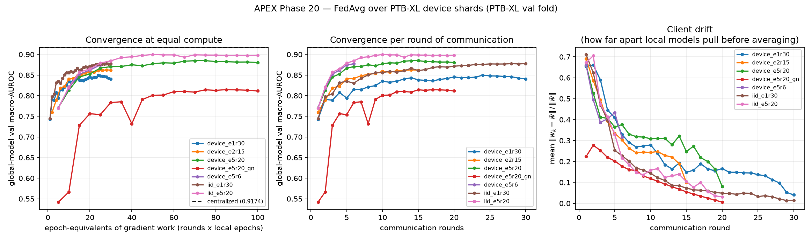
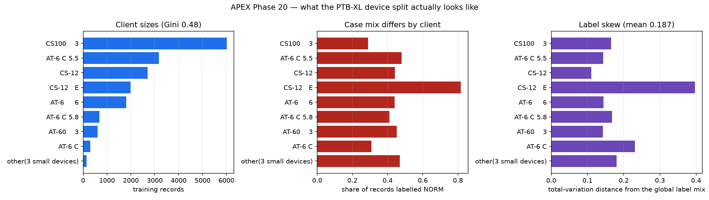

# Phase 20 — Federated learning simulation (FedAvg over PTB-XL device shards)

Clinical data does not move. A model that needs every hospital's ECGs in one bucket is a model that cannot be trained, so the question is not whether federated training is worse than centralized — it is **how much worse, and whether that price is smaller than the price of not collaborating at all**. This phase measures both. Regenerate with `bash scripts/run_federated.sh`.

## Headline

**FedAvg reaches test macro-AUROC 0.8751 against the centralized model's 0.9199 — a gap of -4.48 points (4.87% relative) with no ECG ever leaving its hospital.**

**And it is clearly worth doing.** The best single hospital training alone (`CS100    3`, which holds 35% of all the training data) reaches 0.8268; the most skewed one (`CS-12   E`) reaches 0.7437. FedAvg beats the best of them by +4.84 points and the worst by +13.14, closing **52% of the distance** between the best go-it-alone model and pooling every hospital's data outright. That is the entire argument for federating, and it is the comparison that matters clinically: no hospital in this simulation has the option of the centralized model, so the honest baseline for FedAvg is what they could build alone.

## Results

| model | clients | rounds x E | val AUROC | **test AUROC** | gap | rel. loss |
|---|---:|---:|---:|---:|---:|---:|
| **centralized** (Phase 4 `cnn_bce`) | 1 | 20 epochs | 0.9174 | **0.9199** | — | — |
| `fedavg_device_e5r6` | 9 | 6 x 5 | 0.8774 | 0.8627 | -0.0573 | 6.22% |
| `fedavg_device_e5r20` | 9 | 20 x 5 | 0.8850 | 0.8751 | -0.0448 | 4.87% |
| `fedavg_device_e5r20_gn` | 9 | 20 x 5 | 0.8147 | 0.8159 | -0.1040 | 11.31% |
| `fedavg_device_e2r15` | 9 | 15 x 2 | 0.8625 | 0.8555 | -0.0644 | 7.00% |
| `fedavg_device_e1r30` | 9 | 30 x 1 | 0.8497 | 0.8411 | -0.0789 | 8.58% |
| `fedavg_iid_e5r20` | 9 | 20 x 5 | 0.8998 | 0.8933 | -0.0266 | 2.89% |
| `fedavg_iid_e1r30` | 9 | 30 x 1 | 0.8776 | 0.8741 | -0.0459 | 4.99% |
| `local_CS100__3` | 1 | 30 x 1 | 0.8342 | 0.8268 | -0.0932 | 10.13% |
| `local_CS_12__E` | 1 | 30 x 1 | 0.7542 | 0.7437 | -0.1762 | 19.16% |

All rows are evaluated on the **same held-out test fold 10** with the same code; only the training procedure differs. `rounds x E` is communication rounds by local epochs, so its product is the epoch-equivalents of gradient work — every federated runs above spend between 30 and 100 against the centralized model's 20, i.e. the federated side is never given *less* compute. (Centralized peaked at epoch 14 of 20, so it had converged; the gap below is therefore a lower bound on federation's cost, not an artifact of under-training it.)

## What the clients actually look like

Federated results are meaningless without saying how heterogeneous the clients are, because a partition that is secretly IID makes FedAvg look free. PTB-XL's `device` column — the ECG cart that recorded each study — is the natural proxy for a site, and it is genuinely skewed in both directions that matter:

- **Size skew.** 9 clients over 17,418 training records, largest holding 35% and the largest:smallest ratio 40:1 (Gini 0.48).
- **Label skew.** Mean total-variation distance from the global label mix 0.187, max 0.397. NORM prevalence runs from 29% to 82% across clients.
- **Coverage holes.** 47 of the 71 labels are **entirely absent from at least one client**, so those hospitals contribute gradients that have never seen the condition.

| client | records | share | label skew (TVD) | NORM rate | labels with >=10 positives |
|---|---:|---:|---:|---:|---:|
| `CS100    3` | 6,018 | 34.5% | 0.165 | 29% | 46 |
| `AT-6 C 5.5` | 3,169 | 18.2% | 0.143 | 48% | 51 |
| `CS-12` | 2,701 | 15.5% | 0.111 | 44% | 47 |
| `CS-12   E` | 1,987 | 11.4% | 0.397 | 82% | 16 |
| `AT-6     6` | 1,811 | 10.4% | 0.144 | 44% | 45 |
| `AT-6 C 5.8` | 676 | 3.9% | 0.167 | 41% | 31 |
| `AT-60    3` | 610 | 3.5% | 0.142 | 45% | 21 |
| `AT-6 C` | 295 | 1.7% | 0.231 | 31% | 18 |
| `other(3 small devices)` | 151 | 0.9% | 0.180 | 47% | 14 |

`CS-12   E` is the interesting one: 82% of its records are NORM and only 16 labels have enough positives to learn from, against 40-50 for the other large clients. It looks like an outpatient screening cart rather than an acute unit. In federated terms it is a client whose gradient says "almost everything is normal" — a plausible real hospital, and exactly the kind of participant that pulls a shared model off course.

## Is the gap federation, or is it heterogeneity?

Running FedAvg unchanged on a **random** partition with the *same client count and the same client sizes* — only the label skew removed — separates the two costs that a single federated number confounds:

| | test AUROC | gap vs centralized |
|---|---:|---:|
| centralized | 0.9199 | — |
| FedAvg, IID partition | 0.8933 | -2.66 pp |
| FedAvg, real device partition | 0.8751 | -4.48 pp |

Roughly **1.82 of the 4.48 point gap is attributable to heterogeneity** and the remainder to the mechanics of federation itself (weight averaging, optimizer restarts). Splitting the gap this way matters for what you would do about it. The heterogeneity share is the part that drift-correcting algorithms (FedProx, SCAFFOLD) are designed to attack; the larger share is the price of the setting itself and would need a better federated optimizer (server momentum, adaptive server updates) rather than better handling of non-IID data. Note that the one heterogeneity remedy actually tested here — swapping BatchNorm for GroupNorm — made things substantially *worse*; see below.

## Convergence behaviour

### The local-work / communication trade at fixed compute

All three runs below spend the same 30 epoch-equivalents of gradient work and differ only in how it is split between local epochs and communication rounds:

| local epochs E | rounds | test AUROC | peaked at round | final client drift |
|---:|---:|---:|---:|---:|
| 1 | 30 | 0.8411 | 24/30 | 0.0401 |
| 2 | 15 | 0.8555 | 14/15 | 0.1001 |
| 5 | 6 | 0.8627 | 6/6 | 0.3157 |

**More local work per round wins here** — E=5 reaches 0.8627 against E=1's 0.8411 — which is the *opposite* of the usual client-drift story, and the drift column shows why it is not a contradiction. Drift is real and it does grow with E, but on this problem it is not the binding constraint. The binding constraint is that **only weights cross the network, so the optimizer restarts every round**: AdamW's moment estimates are rebuilt from scratch each time, and with E=1 a client never trains long enough to get past that warm-up before its work is averaged away. Fewer, longer rounds mean fewer restarts. That is a property of FedAvg with an adaptive optimizer, not of the data.

### Federation converges slower, not just lower

2 of the 3 fixed-budget runs above peaked in their **final round**, and the rest peaked late — none had finished improving when the budget ran out. A gap measured there is partly just a measure of stopping early. Re-running the best setting with a 100-epoch-equivalent budget (5.0x the centralized model's 20 epochs) separates the two explanations:

| run | epoch-equivalents | test AUROC | peaked at round |
|---|---:|---:|---:|
| `fedavg_device_e1r30` | 30 | 0.8411 | 24/30 |
| `fedavg_device_e2r15` | 30 | 0.8555 | 14/15 |
| `fedavg_device_e5r6` | 30 | 0.8627 | 6/6 |
| `fedavg_device_e5r20` | 100 | 0.8751 | 15/20 |

Holding E=5 fixed and raising the budget from 30 to 100 epoch-equivalents is worth **+1.25 points** (0.8627 -> 0.8751), and the run finally peaks before its last round (15/20) rather than at it. So part of the apparent cost of federation was simply slow convergence. **The 4.48 points still separating it from centralized is the part that does not close with more compute** — that is the real price, and it is the number the headline quotes.

Note what this costs in the currency a hospital network actually pays. Communication rounds — scheduling, bandwidth, governance, every site online at once — are the expensive resource, not local GPU time, so the middle panel of the figure (quality per round, not per unit of compute) is the axis a deployment plan is written against.

## Is the gap BatchNorm?

Swapping BatchNorm for GroupNorm moves test AUROC 0.8751 -> 0.8159 (-5.92 points). **No — and decisively not.** GroupNorm is far worse, so averaged BatchNorm statistics are not what costs this federated model its accuracy; the cure loses several times more than the disease. The reason is that GroupNorm's advantage over BatchNorm shows up at *small* batch sizes, where a batch is too small to estimate a stable mean and variance. Local batches here are 128 records, which is ample, so BatchNorm's estimates are good and giving them up forfeits a real regularization and conditioning benefit in exchange for fixing a problem that was not binding.

This is worth stating plainly because averaged BatchNorm statistics are the most commonly blamed culprit in federated vision work, and the obvious move — reach for GroupNorm — would have made this model substantially worse. The drift figures should not be read as contradicting that: client drift is computed over all float tensors, which for a BatchNorm model *includes* the running statistics, so the GroupNorm run's much lower drift (0.006 vs 0.081) partly reflects having fewer things to diverge, not a better-behaved optimization.

## Implementation notes

- **Weighted averaging.** The server averages client weights by sample count `n_k`, as FedAvg specifies. With this partition a uniform average would give a 151-record shard the same authority as a 6,018-record one.
- **Only the training folds are partitioned.** Validation (fold 9) and test (fold 10) stay global and untouched, so every number here is comparable to Phase 4's. Splitting the test set per client would measure a different thing.
- **Cache alignment is asserted, not assumed.** Client assignment maps metadata rows onto cached tensor rows; if those ever fell out of order every client would get the wrong records and the run would still complete with plausible, wrong numbers. `partition.assert_aligned` re-encodes the labels and compares.
- **Optimizer state is reset every round.** Only weights cross the network, so AdamW's moment estimates cannot persist on the server. That restart is a real part of FedAvg's cost and is not papered over here.
- **BatchNorm statistics are averaged**, which is what plain FedAvg does and is also its best-known weakness: `running_mean`/`running_var` are estimated from whatever data a client holds, and under this split they genuinely differ. `--buffer-mode` and `--norm gn` (GroupNorm, which keeps no cross-batch statistics at all) exist to test that.
- **What crosses the network.** Model weights only — no records, no labels, no gradients. The single global quantity used is the per-label positive count behind `pos_weight`, an aggregate of the kind federated deployments share via secure aggregation; `--pos-weight local` removes even that.

## Limitations

- **This is a simulation, not a deployment.** It measures the statistical cost of partitioned training. It does not implement secure aggregation, differential privacy, or defences against a malicious client, and FedAvg weight updates are known to leak information about training data — a real deployment needs all three, and each carries its own accuracy cost on top of the gap measured here.
- **Device is a proxy for site, not a site.** PTB-XL's own `site` column is far more skewed (3 of 51 sites hold 93% of records) and 0.9% of patients appear on more than one device, so the client boundary is not perfectly clean. The patient-level fold split still guarantees no train/test patient leakage.
- **Model selection uses a global validation fold.** A true federation has no such pooled set and would need federated evaluation; using one here favours the federated model slightly and keeps it comparable to Phase 4.
- **One seed per configuration.** The differences that carry weight below are the large ones; sub-half-point gaps are within seed noise.
- Everything inherited from the centralized model — the Phase-13 over-flagging, the Phase-14/18 demographic gaps, the Phase-17 miscalibration — is inherited here too. Federation changes where the data lives, not what the model is bad at.
