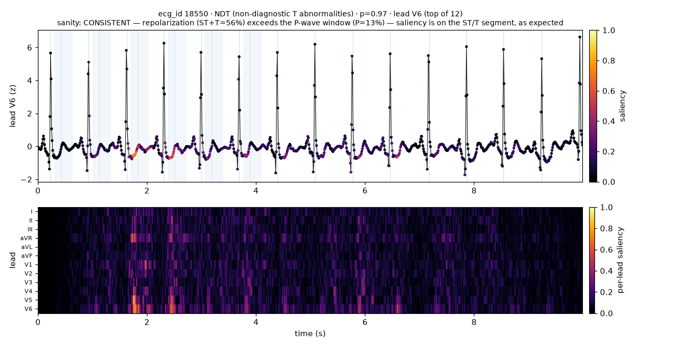
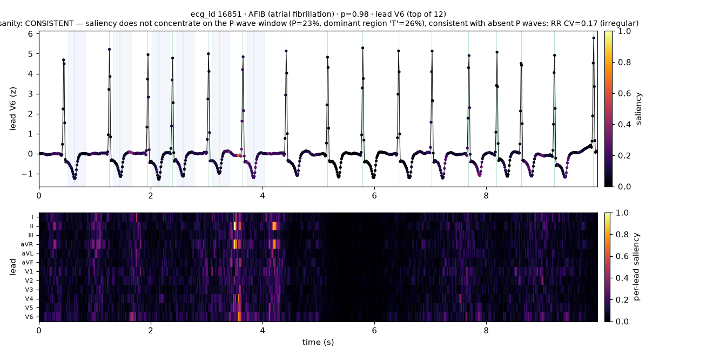
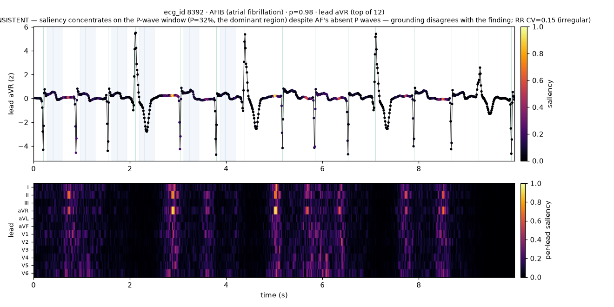

# Phase 5 — Grounding layer: per-lead saliency & clinical sanity check

The grounding layer answers *where in the ECG* a detection came from. Given a recording
and a predicted label it returns a **per-lead saliency trace** — a `(12, T)` array aligned
sample-for-sample with the signal — and we check whether that trace lands where a
cardiologist would look.

Regenerate everything here with:

```bash
python scripts/run_grounding.py --ecg-id 18550 --label NDT   # one record -> figure + JSON
python scripts/run_grounding.py --scan AFIB --n 60           # AF sanity sweep
python scripts/run_grounding.py --scan STTC --n 60           # ST/T sanity sweep
```

Model: `outputs/final_best.pt` (CNN + class-weighted BCE, the Phase-4 winner, test
macro-AUROC 0.920). Signals are the Phase-2 preprocessed input (100 Hz, band-pass
0.5–40 Hz, per-lead z-score); R-peaks from Pan–Tompkins on lead II.

## Method

Plain Grad-CAM does not give a *lead* axis here: the CNN stem (`Conv1d(12 → 64)`) mixes
all 12 leads at the first layer, so every downstream activation is lead-agnostic and
Grad-CAM on the last conv stage yields only a **time** map `(T')`. We recover the lead
axis with **guided Grad-CAM**:

```
per_lead[l, t] = |∂ logit_c / ∂ x[l, t]|  ·  cam_c(t)
```

- `cam_c(t)` — Grad-CAM over the last residual stage, ReLU'd, upsampled to raw time and
  scaled to [0, 1]. Class-discriminative and smooth; answers **when**.
- input-gradient magnitude — naturally `(12, T)`; answers **which lead**, but is noisy on
  its own, so the CAM envelope gates it to the class-relevant window.

The trace is globally normalized to [0, 1] so lead magnitudes are comparable, and we
report a per-lead **importance** (share of total saliency mass) whose `argmax` is the
single most influential lead. `method="input_grad"` and `method="gradcam"` are available
for ablation. See [`src/grounding/saliency.py`](../../src/grounding/saliency.py).

### Region attribution

To grade a trace we map it onto beat-relative wave windows
([`src/grounding/regions.py`](../../src/grounding/regions.py)):

| region | window vs. R-peak | what lives there |
|--------|-------------------|------------------|
| P | −200…−80 ms | atrial depolarization (P wave) |
| QRS | −50…+50 ms | ventricular depolarization |
| ST | +80…+200 ms | early repolarization (J-point → ST) |
| T | +200…+400 ms | ventricular repolarization (T wave) |
| baseline | everything else | T–P interval / inter-beat (fibrillatory) region |

Every sample is assigned to **exactly one** region (a partition, so the mass fractions
sum to 1). Where windows from adjacent beats overlap at fast rates, the sample goes to
the more reliably identifiable wave — QRS > ST > T > P — which keeps a prior beat's T
wave from masquerading as the next beat's P wave.

## Clinical expectations checked

- **ST/T & injury findings** (STTC superclass, `INJ*`, MI codes) → saliency should sit on
  the **repolarization** segment (ST + T), *not* the P wave.
- **Atrial fibrillation / flutter** (`AFIB`, `AFLT`) → *irregular RR* + *absent P waves*,
  so saliency should **not** concentrate on the P-wave window, and the record's RR
  intervals should genuinely be irregular.

A verdict is `consistent` / `inconsistent` / `inconclusive` (fewer than 3 beats).
See [`src/grounding/sanity.py`](../../src/grounding/sanity.py).

## Results

Detected true-positive records (model prob ≥ 0.5), sampled from the full dataset,
seed 42, n = 60 each:

| finding family | consistent | inconclusive | mean P | mean ST+T (repol.) | mean baseline | mean RR-CV |
|----------------|-----------:|-------------:|-------:|-------------------:|--------------:|-----------:|
| **ST/T changes** (STTC) | **57 / 57 (100%)** | 3 | 0.15 | **0.42** | 0.30 | 0.09 |
| **Atrial fibrillation** (AFIB) | **59 / 60 (98%)** | 0 | 0.19 | 0.35 | **0.34** | **0.22** |

Both families behave as clinical intuition predicts:

- **ST/T findings land on repolarization.** Saliency mass in ST + T (0.42) is roughly
  triple the P-wave window (0.15); every scored record passed. The model reads the ST
  segment and T wave, not the P wave, for ST/T abnormalities.
- **AF avoids the P wave and tracks the irregular baseline.** The single largest region
  for AF is the inter-beat **baseline** (0.34) — the fibrillatory, RR-timing region —
  and the RR coefficient of variation (0.22) confirms these records really are
  irregularly irregular, vs. 0.09 for the (regular) ST/T cohort. Saliency stays off the
  (absent) P wave.

### Representative cases

**ST/T change — grounded on the T wave (consistent).** `ecg_id 18550`, `NDT`
(non-diagnostic T abnormality), p = 0.97. Saliency concentrates on the ST/T segment
after each QRS (blue reference bands), strongest in V5/V6.



**Atrial fibrillation — grounded off the P wave (consistent).** `ecg_id 16851`, `AFIB`,
p = 0.98. Dominant region is the inter-beat baseline; P share 23%, RR-CV 0.17.



## Documented finding — where grounding disagrees

**`ecg_id 8392`, `AFIB`, p = 0.98 → `inconsistent`.** The saliency's dominant region is
the **P-wave window (32%)** — the model reaches a high-confidence AF call while keying on
the pre-QRS region where, in AF, there is no organized P wave (RR-CV 0.15 confirms the
rhythm *is* irregular). This is logged, not hidden: it is the exact failure mode grounding
exists to surface — the right label for a partly wrong reason (or grounding mislocalizing
the fibrillatory waves that sit just before the QRS as "P").



This is why `src/eval/hallucination.py` treats an ungrounded / wrongly-grounded finding as
a flag for manual review rather than trusting the label alone.

## Limitations

- **Fixed wave windows, no fiducial delineation.** Windows are rate-independent
  approximations; at high rates (e.g. AF with rapid ventricular response ~150 bpm) the P
  window overlaps the prior T wave and collapses toward it, so the P share is
  conservative there. RR-CV and beat count are reported so a reader can judge.
- **Lead-mixing stem.** The lead axis comes from input gradients, not from the conv
  features (which are lead-agnostic); it is a sensitivity attribution, not proof the model
  "used" that lead in isolation.
- **Input-gradient noise.** Raw input gradients are noisy; the CAM envelope and a light
  20 ms moving average tame this, at the cost of sub-window temporal precision.
- **Sanity, not ground truth.** These checks encode textbook expectations for two finding
  families. They are a directional audit of the explanation layer, not a validated
  localization metric against expert annotations.
